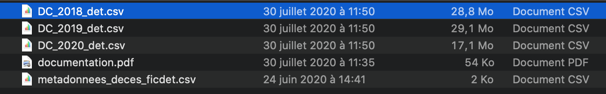
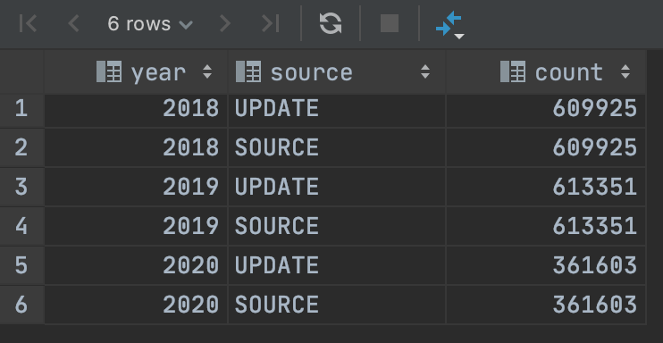

# France death statistics using Postgresql and CubeJs on Node

## Quick Start

* Clone git repo
>git clone https://github.com/ng-galien/insee.git && cd insee

* Unzip the dump

>unzip min-dump.sql.zip 

* Create the database from minimal dump
>psql -U postgres -d postgres -f min-dump.sql

* Create your credential file
>touch .env && echo -e "CUBEJS_DB_HOST=localhost\nCUBEJS_DB_NAME=insee\nCUBEJS_DB_USER=postgres\nCUBEJS_DB_PASS=postgres\nCUBEJS_DB_TYPE=postgres\nCUBEJS_API_SECRET=secret"  >> .env

Modify *.env* file to with your credentials, CUBEJS_DB_USER and CUBEJS_DB_PASS

```
CUBEJS_DB_HOST=localhost
CUBEJS_DB_NAME=insee
CUBEJS_DB_USER=my_user
CUBEJS_DB_PASS=my_user_pwd
CUBEJS_DB_TYPE=postgres
CUBEJS_API_SECRET=secret
```

* Run Node Server
>npm install && npm run dev

* Open browser and play with measures, dimensions and filters
>[http://localhost:4000](http://localhost:4000)


## Available statistics

### Granularity / Drill

* Day
* Week
* Month
* Quarter
* Year

### Values 
* Total death/day
* Total by age groups
* Total by sex
* Normalized by region population

### Dimensions / Filters

* State: French department
* Region: French region

## Manual installation and update

Create the database.

>create database insee;

Table definitions are in **schema.sql**

### Database for insee data source
```sql
drop table if exists insee_update;

create table insee_update
(
    adec     integer,
    mdec     integer,
    jdec     integer,
    depdec   varchar(50),
    comdec   varchar(50),
    anaiss   integer,
    mnaiss   integer,
    jnaiss   integer,
    sexe     varchar(50),
    depdom   varchar(50),
    lieudec2 varchar(50)
);
```

### Database for France states / regions
```sql
drop table if exists insee;
drop table if exists state;

create table state
(
    id            bigserial   not null
        constraint departement_pkey1
            primary key,
    code          varchar(3)  not null
        constraint departement_code_key
            unique,
    name          varchar(30) not null
        constraint departement_name_key
            unique,
    h_pop_cat_1   integer,
    h_pop_cat_2   integer,
    h_pop_cat_3   integer,
    h_pop_cat_4   integer,
    h_pop_cat_5   integer,
    h_pop         integer,
    f_pop_cat_1   integer,
    f_pop_cat_2   integer,
    f_pop_cat_3   integer,
    f_pop_cat_4   integer,
    f_pop_cat_5   integer,
    f_pop         integer,
    tot_pop_cat_1 integer,
    tot_pop_cat_2 integer,
    tot_pop_cat_3 integer,
    tot_pop_cat_4 integer,
    tot_pop_cat_5 integer,
    tot_pop       integer,
    diab          integer,
    region        varchar(100)
);

create index state_code_idx
    on state (code);

create index state_name_idx
    on state (name);

create index state_region_idx
    on state (region);
```

State inserts are located in **update-states.sql**

```sql
INSERT INTO public.state (id, code, name, h_pop_cat_1, h_pop_cat_2, h_pop_cat_3, h_pop_cat_4, h_pop_cat_5, h_pop,
                          f_pop_cat_1, f_pop_cat_2, f_pop_cat_3, f_pop_cat_4, f_pop_cat_5, f_pop, tot_pop_cat_1,
                          tot_pop_cat_2, tot_pop_cat_3, tot_pop_cat_4, tot_pop_cat_5, tot_pop, diab, region)
VALUES (100, '01', 'Ain', 167666, 151084, 179469, 104453, 54283, 656955, 86596, 75213, 89272, 50205, 22059, 323345,
        81070, 75871, 90197, 54248, 32224, 333610, 26135, 'Auvergne-Rhône-Alpes');
...
```


### Database for stats
```sql
DROP TYPE IF EXISTS location_type;
CREATE TYPE location_type AS ENUM (
    'MEDIC', 'EHPAD', 'DOM', 'PUBLIC', 'NA'
    );

DROP TYPE IF EXISTS sex_type;
CREATE TYPE sex_type AS ENUM (
    'MALE', 'FEMALE'
    );

create table if not exists insee
(
    id           bigserial not null
        constraint insee_pkey
            primary key,
    death_state  bigint    not null references state (id),
    dom_state    bigint references state (id),
    death_date   date,
    birth_date   date,
    age          interval,
    age_year     integer,
    age_group_5  integer,
    age_group_10 integer,
    age_cat_1    integer,
    age_cat_2    integer,
    age_cat_3    integer,
    age_cat_4    integer,
    age_cat_5    integer,
    sex          sex_type,
    location     location_type
);

create index insee_death_date_idx
    on insee (death_date);
create index insee_birth_date_idx
    on insee (birth_date);
create index insee_age_idx
    on insee (age);
create index insee_age_year_idx
    on insee (age_year);
create index insee_sex_idx
    on insee (sex);
create index insee_location_idx
    on insee (location);
```

## Source

### CSV data

Download and extract data from INSEE website

> https://www.insee.fr/fr/statistiques/4487988?sommaire=4487854



### Import with psql

With psql use **\copy** command to import csv files.

```bash
$ psql -U postgres -h localhost -d insee  
\copy insee_update FROM '../2020-07-31_detail/DC_2018_det.csv' DELIMITER ';' CSV HEADER;  
\copy insee_update FROM '../2020-07-31_detail/DC_2019_det.csv' DELIMITER ';' CSV HEADER;  
\copy insee_update FROM '../2020-07-31_detail/DC_2020_det.csv' DELIMITER ';' CSV HEADER;
```

## Update the statistics table

SQL statment in **update-insee_db.sql**

```sql
-- correct dates
update insee_update
set mdec = 1
where mdec = 0;

update insee_update
set jdec = 1
where jdec = 0;

update insee_update
set mnaiss = 1
where mnaiss = 0;

update insee_update
set jnaiss = 1
where jnaiss = 0;

delete
from insee
where id > 0;

/*
 Populate insee
 */

insert into insee (death_state,
                   dom_state,
                   death_date,
                   birth_date,
                   age,
                   age_year,
                   age_group_5,
                   age_group_10,
                   age_cat_1,
                   age_cat_2,
                   age_cat_3,
                   age_cat_4,
                   age_cat_5,
                   sex,
                   location)
SELECT (select state.id from state state where depdec = state.code limit 1),
       (select state.id from state state where depdom = state.code limit 1),
       death,
       birth,
       age,
       year,
       trunc(year::float / 5.0),
       trunc(year::float / 10.0),
       case when year between 0 and 19 then 1 else 0 end,
       case when year between 20 and 39 then 1 else 0 end,
       case when year between 40 and 59 then 1 else 0 end,
       case when year between 60 and 75 then 1 else 0 end,
       case when year > 74 then 1 else 0 end,
       case sexe
           when 'M' then 'MALE'::sex_type
           when 'F' then 'FEMALE'::sex_type
           else Null::sex_type end,
       case lieudec2
           when 'HopCli' then 'MEDIC'::location_type
           when 'HosMar' then 'EHPAD'::location_type
           when 'Logem' then 'DOM'::location_type
           when 'Autres' then 'PUBLIC'::location_type
           else 'NA'::location_type
           end
FROM (select depdec,
             depdom,
             make_date(adec, mdec, jdec)                                                  as death,
             make_date(anaiss, mnaiss, jnaiss)                                            as birth,
             age(make_date(adec, mdec, jdec),
                 make_date(anaiss, mnaiss, jnaiss))                                       as age,
             date_part(
                     'year',
                     age(make_date(adec, mdec, jdec), make_date(anaiss, mnaiss, jnaiss))) as year,
             lieudec2,
             sexe
      from insee_update) u;
```

### Check Data

Control the record's count in source and populated tables

```sql
SELECT c.year,
       c.source,
       c.count
FROM (
         SELECT 'UPDATE'                      as source,
                count(*)                      as count,
                date_part('year', death_date) as year
         from insee
         GROUP BY date_part('year', death_date)
         UNION
         SELECT 'SOURCE',
                count(*),
                adec
         from insee_update
         group by adec) c
order by year;
```

### Compact database

This database is used by CubeJS.

```sql
DROP table if exists insee_stat;
CREATE table insee_stat as

SELECT state.code || '-' || state.name as state,
       state.region                      as region,
       source.death_date as date,
       source.sum_tot,
       source.sum_cat_1,
       source.sum_cat_2,
       source.sum_cat_3,
       source.sum_cat_4,
       source.sum_cat_5,
       source.sum_male,
       source.sum_female,
       round(source.sum_tot::numeric / state.tot_pop::numeric * 100000, 2) as norm_tot,
       round(source.sum_cat_1::numeric / state.tot_pop_cat_1::numeric * 100000, 2) as norm_cat_1,
       round(source.sum_cat_2::numeric / state.tot_pop_cat_2::numeric * 100000, 2) as norm_cat_2,
       round(source.sum_cat_3::numeric / state.tot_pop_cat_3::numeric * 100000, 2) as norm_cat_3,
       round(source.sum_cat_4::numeric / state.tot_pop_cat_4::numeric * 100000, 2) as norm_cat_4,
       round(source.sum_cat_5::numeric / state.tot_pop_cat_5::numeric * 100000, 2) as norm_cat_5,
       round(source.sum_male::numeric / state.f_pop::numeric * 100000, 2) as norm_male,
       round(source.sum_female::numeric / state.h_pop::numeric * 100000, 2) as norm_female
FROM (SELECT ins.death_date,
             ins.death_state,
             count(ins.id)      as sum_tot,
             sum(ins.age_cat_1) as sum_cat_1,
             sum(ins.age_cat_2) as sum_cat_2,
             sum(ins.age_cat_3) as sum_cat_3,
             sum(ins.age_cat_4) as sum_cat_4,
             sum(ins.age_cat_5) as sum_cat_5,
             sum(case when ins.sex = 'MALE' then 1 else 0 end) as sum_male,
             sum(case when ins.sex = 'FEMALE' then 1 else 0 end) as sum_female
      FROM insee ins
      group by ins.death_date, ins.death_state, ins.sex
      order by ins.death_date, ins.death_state, ins.sex) source
         join state state on source.death_state = state.id;
```



## Run Cube JS

### Create a credential file

Credentials are stored in a **.env** file in the root directory

```bash
$ touch .env
$ echo "CUBEJS_DB_HOST=localhost
CUBEJS_DB_NAME=insee
CUBEJS_DB_USER=postgres
CUBEJS_DB_PASS=postgres
CUBEJS_DB_TYPE=postgres
CUBEJS_API_SECRET=secret" >> .env
```

Instal Cube and start Node

```bash
$ npm install  
$ npm run dev
````

Open [http://localhost:4000](http://localhost:4000)

